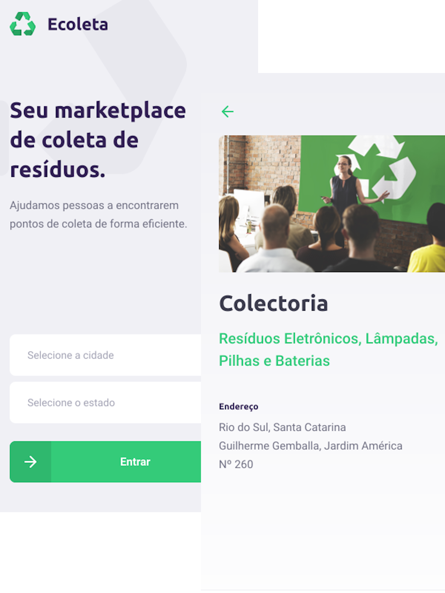

<h1 align="center">
  
  
</h1>

<h2>
  Next Level Week #01 - Ecoleta
</h2>

<p align="center">
  <a href="https://www.linkedin.com/in/pedrohenrique-machado/">
    
  </a>

  <a href="https://github.com/phenrimachado/NLW-01/commits/master">
    
  </a>

  
   <a href="https://github.com/phenrimachado/NLW-01/stargazers">
    
  </a>
</p>

<p align="center">
  <a href="#-next-level-week">Next Level Week</a>&nbsp;&nbsp;&nbsp;-&nbsp;&nbsp;&nbsp;
  <a href="#-project">Project</a>&nbsp;&nbsp;&nbsp;-&nbsp;&nbsp;&nbsp;
  <a href="#-Technologies">Technologies</a>&nbsp;&nbsp;&nbsp;-&nbsp;&nbsp;&nbsp;
  <a href="#-layout">Layout</a>&nbsp;&nbsp;&nbsp;-&nbsp;&nbsp;&nbsp;
  <a href="#-how-to-use">How to install and run</a>&nbsp;&nbsp;&nbsp;-&nbsp;&nbsp;&nbsp;<a href="#-how-to-contribute">How to contribute</a>&nbsp;&nbsp;&nbsp;-&nbsp;&nbsp;&nbsp;
  <a href="#-license">License</a>
</p>

# 💭 Next Level Week?

Next Level Week is a technology week focused on learning web development using the latest technologies in the job market.

## 🖥 Project 

Ecoleta is a project developed based on international environment week. 
That aims to connect people to companies that collect specific waste such as light bulbs, batteries, cooking oil, etc.

<h1 align="center">
  
</h1>

## 🛠 Technologies

This project was developed with the following technologies:

- [Node.js][nodejs]
- [TypeScript][typescript]
- [React][reactjs]
- [React Native][rn]
- [Expo][expo]

## 📐 Layout

To access the layout of the project use [Figma](https://www.figma.com/file/1SxgOMojOB2zYT0Mdk28lB/).

## ℹ️ How To Use

To clone and run this application, you'll need [Git](https://git-scm.com), [Node.js][nodejs] + [Npm][npm] installed on your computer.

From your command line:

### Install API Server

```bash
# Clone this repository
$ git clone https://github.com/phenrimachado/NLW-01

# Go into the repository
$ cd NLW-01/server

# Install dependencies
$ npm install

# Run Migrates
$ npm knex:migrate

# Run Seeds
$ npm knex:seed

# Start server
$ npm run dev

# running on port 3333
```

### Install Front-end

```bash

# Go into the repository
$ cd NLW-01/web

# Install dependencies
$ npm install

# Run
$ npm start

# running on port 3000
```

### Install Mobile

```bash

# Go into the repository
$ cd NLW-01/mobile

# Install dependencies
$ npm install

# Run
$ npm start

# Expo will open on your default browser, just scan the qrcode in expo app on your smartphone

# Install too the fonts that we used in this project mobile, execute:
$ expo install expo-font @expo-google-fonts/ubuntu @expo-google-fonts/roboto

```

## 📝 License

This project is under the MIT license. See the [LICENSE](https://github.com/phenrimachado/NLW-01/blob/master/LICENSE) for details.


Made by Pedro Machado with 💙
[Linkedin](https://www.linkedin.com/in/pedrohenrique-machado/)

[nodejs]: https://nodejs.org/
[typescript]: https://www.typescriptlang.org/
[expo]: https://expo.io/
[reactjs]: https://reactjs.org
[rn]: https://facebook.github.io/react-native/
[npm]: https://www.npmjs.com/
